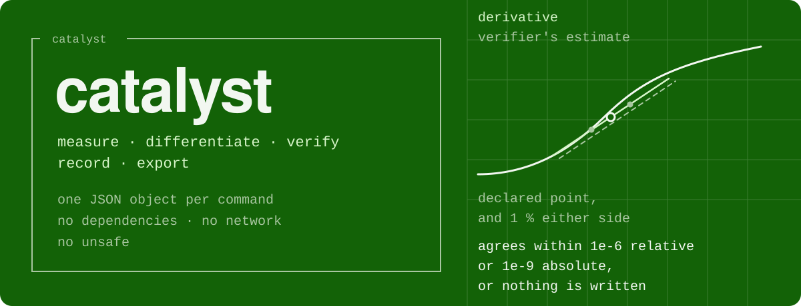
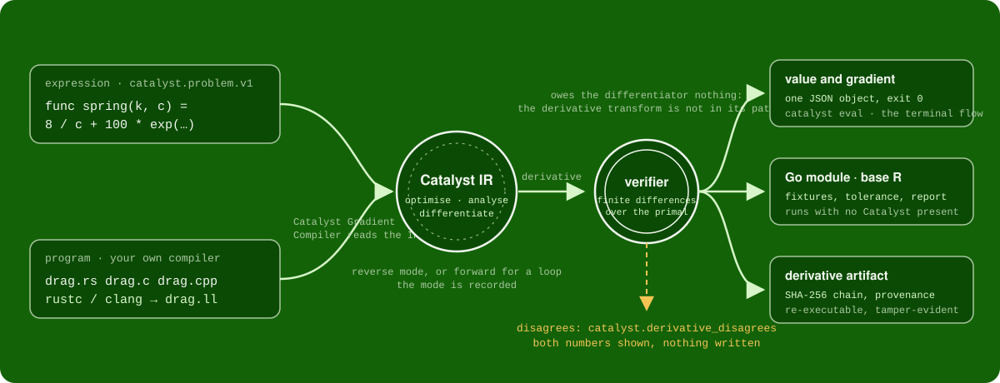
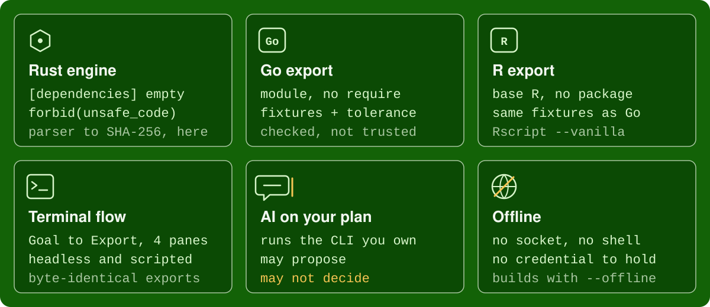
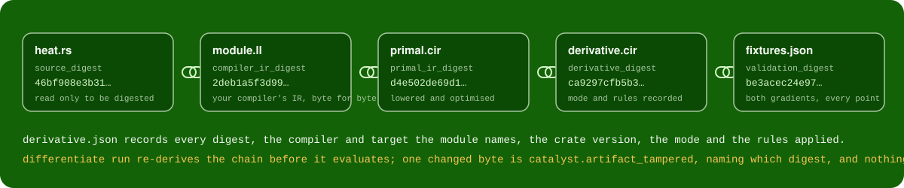
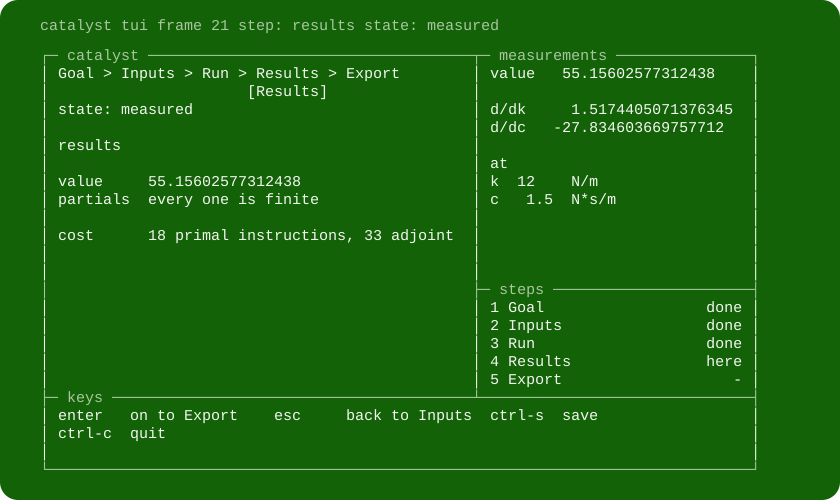

<div align="center">



# Catalyst

**A verification system for engineering computations.**

Give it a function of a few named parameters, or a program your own compiler has already built.
It measures the value, differentiates it, checks every derivative with a verifier that owes the differentiator nothing,
records where every number came from, and exports only what it could confirm.

[](https://github.com/lovettsendit/catalyst/actions/workflows/ci.yml)
[](LICENSE)
[](Cargo.toml)
[](src/lib.rs)

</div>

```sh
catalyst eval --problem spring.json
```

```json
{"ok":true,"name":"spring","value":55.15602577312438,"gradient":{"k":1.5174405071376345,"c":-27.834603669757712},"finite":true,"cost":{"primal_insts":18.0,"adjoint_insts":33.0}}
```

One command, one JSON object: the value, what moves it, and the cost of finding out. Everything else in this README is a variation on that line.

## Contents

- [What Catalyst does](#what-catalyst-does)
- [Sixty seconds](#sixty-seconds)
- [From a problem to a checked export](#from-a-problem-to-a-checked-export)
- [Differentiate a program you already have](#differentiate-a-program-you-already-have)
- [The guided terminal](#the-guided-terminal)
- [AI on the plan you already pay for](#ai-on-the-plan-you-already-pay-for)
- [The tool surface](#the-tool-surface)
- [Rehearse a failing local service](#rehearse-a-failing-local-service)
- [One request on stdin](#one-request-on-stdin)
- [What is refused, always](#what-is-refused-always)
- [Security and authority](#security-and-authority)
- [Install and build](#install-and-build)
- [Command reference](#command-reference)
- [How it fits together](#how-it-fits-together)
- [Development and testing](#development-and-testing)
- [Licence and security](#licence-and-security)

## What Catalyst does



Catalyst has two front doors and one engine.

- **An expression.** `func spring(k, c) = 8 / c + 100 * exp(…)`, written in a small language of named parameters, arithmetic and the usual functions. Catalyst parses it.
- **A program.** Rust, C or C++ that you compile yourself to textual LLVM IR. Catalyst never runs a compiler and never runs your program; the **Catalyst Gradient Compiler** reads the IR your compiler wrote and lowers it into the same engine.

From there the two are the same computation. It is optimised, analysed and differentiated by automatic differentiation over Catalyst's own SSA intermediate representation. Then the part that makes the rest trustworthy: Catalyst's verifier evaluates the primal with the derivative transform nowhere in its path, forms central finite-difference estimates at the point you asked for and around it, and compares. A derivative that agrees is written out as a JSON answer, a Go module, a base-R directory or a derivative artifact with a SHA-256 chain. A derivative that disagrees is refused with both numbers in the message, and nothing is written.

In plain terms: Catalyst does not ask you to trust its differentiator. It checks the differentiator's work with a second, independent method every single time, and it only hands you results that passed.



The crate has **no dependencies**. `[dependencies]` is empty as a design constraint, and `#![forbid(unsafe_code)]` makes an `unsafe` block anywhere a compile error. The parser, the IR, the optimiser, both differentiation transforms, the interpreter, the LLVM IR reader, the finite-difference verifier, the SHA-256, the JSON, the Go and R emitters and the terminal front end are all in this tree.

## Sixty seconds

```sh
cargo build --offline --locked --release       # no network needed, ever
cargo test --offline --locked                  # the engine, and every acceptance oracle
export PATH="$PWD/target/release:$PATH"

catalyst eval --problem spring.json            # value and gradient
catalyst export go --problem spring.json --out export
catalyst tui                                   # the guided front end
catalyst differentiate --describe              # the two differentiation backends
```

Every command prints **one JSON object**. Success is `{"ok":true, …}` and exit 0. A refusal is `{"ok":false,"code":"catalyst.…","detail":"…","remedy":"…"}`, exit 2, and **a refused command writes nothing**: not a directory, not a file. `--help` on any command prints plain text. A panic never happens on any input; the hostile-input oracle exists to keep it that way.

Paths you name (`--out`, `--problem`, `--module`, and every other path flag) must resolve inside the directory you run in, with no `..` and no symlink. An absolute path is accepted only if it lies inside that directory. Output directories must be empty or absent. Anything else is `catalyst.path_refused` before a single byte is written. No user-supplied string is ever passed to a shell.

## From a problem to a checked export

A problem is one JSON document. This one is a second-order step response with stiffness `k` and damping `c`:

```json
{
  "schema": "catalyst.problem.v1",
  "name": "spring",
  "goal": "settle fast without overshoot",
  "function": "func spring(k, c) = 8 / c + 100 * exp(0 - 3.141592653589793 * c / sqrt(4 * k - c * c))",
  "inputs": { "k": 12.0, "c": 1.5 },
  "domains": {
    "k": { "min": 1.0, "max": 100.0, "unit": "N/m" },
    "c": { "min": 0.1, "max": 1.9, "unit": "N*s/m" }
  }
}
```

Every parameter needs an entry in both `inputs` and `domains`. A missing one, an unknown name, a non-finite number or a value outside its declared domain is refused **by name** rather than guessed at:

```json
{"ok":false,"code":"catalyst.input_out_of_domain","detail":"the input for `c` is outside the domain declared for it","remedy":"move the input inside [min, max], or widen the domain to include it"}
```

### Measure it

```sh
catalyst eval --problem spring.json
```

```json
{"ok":true,"name":"spring","value":55.15602577312438,"gradient":{"k":1.5174405071376345,"c":-27.834603669757712},"finite":true,"cost":{"primal_insts":18.0,"adjoint_insts":33.0}}
```

The gradient says that at this operating point a unit of damping buys far more than a unit of stiffness, and in which direction. That is the number an engineer wants before touching either.

### Export it, then run the export with Catalyst absent

```sh
catalyst export go --problem spring.json --out export
cd export && go vet ./... && go build -o exp . && ./exp fixtures.json
```

```json
{"ok":true,"out":"export","files":["go.mod","function.go","main.go","parameters.json","fixtures.json","validation-report.md"],"cases":8.0}
```

The Go export is six files. `go.mod` has no `require`. `function.go` is straight-line Go generated from the optimised IR and its adjoint, importing only `math`, with `Value`, `Gradient` and `InDomain`. `fixtures.json` carries the Rust engine's own numbers at the declared point, two interior points, every parameter at each of its bounds, and an out-of-domain case that must be **refused**, all under a declared tolerance. `validation-report.md` says what was checked and what was not. Two exports of one problem are the same bytes.

Running `./exp fixtures.json` prints one line per case, each either a value with its gradient, a `refused` for the out-of-domain case, or `nonfinite`. So the export is checked against a measurement, not trusted because it compiled.

```sh
catalyst export r --problem spring.json --out export-r
cd export-r && Rscript --vanilla test_function.R
```

The R export is five files of base R that load no package by any spelling: `function.R`, `parameters.R`, `fixtures.R`, `test_function.R`, `validation-report.md`. Go and R are two printings of one lowered instruction list, so they agree to the last digit the fixtures declare.

### Check it a third way

Two independent checkers live in this repository and re-check any export without the crate:

```sh
cd go/catalyst && go run . -export ../../export      # its own parser and forward-mode duals
```

```text
checked 8 cases in export
```

`R/catalyst.R` does the same for R with `catalyst_check_export(dir)`. Each **returns how many cases it checked**, because "it passed" and "it checked nothing" must never look the same, and each stops, naming the case, on the first disagreement.

## Differentiate a program you already have

The expression language is deliberately small. A real program has branches, loops and calls, and teaching Catalyst every source language would make it a second compiler. So you compile with the compiler you already use and hand Catalyst the LLVM IR text it wrote. That is the **Catalyst Gradient Compiler**.

```rust
#[no_mangle]
pub extern "C" fn heat(x: f64, y: f64) -> f64 {
    let adjusted = if y > 1.0 { y * 0.8 } else { y };
    x * adjusted.exp()
}
```

```sh
rustc --emit=llvm-ir -O -C panic=abort -C debuginfo=0 -C no-vectorize-slp -C no-vectorize-loops heat.rs -o heat.ll
catalyst differentiate llvm --module heat.ll --function heat --inputs x,y --at 1.5,2 --out derivative --source heat.rs
```

```json
{"ok":true,"out":"derivative","backend":"cgc","mode":"reverse","function":"heat","inputs":["x","y"],"at":{"x":1.5,"y":2.0},"value":7.429548636592672,"gradient":{"x":4.953032424395115,"y":5.943638909274139},"finite":true,"validation":{"points":5.0,"passed":5.0,"relative_tolerance":1e-6,"absolute_tolerance":1e-9},"assurance":{"computation_kind":"llvm","differentiation_backend":"cgc","validated":true,"portable_export":false},"files":["derivative.json","module.ll","primal.cir","derivative.cir","fixtures.json","validation-report.md"]}
```

`clang -S -emit-llvm -O2 -fno-vectorize -fno-slp-vectorize heat.c -o heat.ll` does the same for C and C++. The no-vectorise flags matter. The IR subset this phase accepts is stated exactly, in `docs/interface.md`, as what an optimising compiler emits for scalar numerical code: real and integer arithmetic, comparisons, selects, branches, loops, phis, the math intrinsics and libm calls, and calls to functions the module defines. Memory, arrays, structs and vectors are the next phase of the Catalyst Gradient Compiler, so an instruction outside the subset is refused as `catalyst.llvm_unsupported` with its line number, and a call the engine cannot see through is `catalyst.opaque_call` before anything is executed. A refusal names what fell outside; nothing is guessed at.

What happened, step by step:

1. The IR was lowered to Catalyst's own IR. Branches, loops, phis, integer counters, comparisons and selects are all accepted.
2. It was differentiated. Reverse mode here; forward mode for a function with a loop, and **the mode is recorded**, never silently swapped.
3. The program ran only inside Catalyst's interpreter, which has no instruction that can reach the operating system and a step budget so a runaway loop is refused in seconds.
4. The verifier evaluated the primal and formed finite-difference estimates at the declared point and with each input moved one per cent up and down: five points for two inputs. Every estimate agreed within the tolerance, so `validated` is `true` and the artifact was written.

`validation-report.md` shows the comparison for every point:

```text
| input | derivative         | verifier's estimate | agrees |
| `x`   | 4.953032424395115  | 4.953032424441043   | yes    |
| `y`   | 5.943638909274139  | 5.943638909533532   | yes    |
```

It ends with a `Remaining uncertainty` section that says what was **not** checked: the derivative was tested at those points and nowhere else, and a finite-difference estimate is evidence rather than proof. Catalyst writes that sentence into every artifact because it is true.

### The artifact is evidence, not a mystery binary



`derivative/` holds the module byte for byte, the primal and the derivative in Catalyst's IR, fixtures with **both** the derivative's numbers and the verifier's estimates, the validation report, and `derivative.json`: a chain of SHA-256 digests from the source through the IR to the derivative and its validation, the compiler and target the module itself names, the crate version, the mode, the rules applied, and an `assurance` block that says plainly which lane produced the number:

```json
"provenance":{"compiler":"rustc version 1.98.0 (88d9e12ae 2026-08-18)","target_triple":"x86_64-unknown-linux-gnu","cgc_version":"0.1.0","mode":"reverse","inputs":["x","y"],"output":"heat"},
"assurance":{"computation_kind":"llvm","differentiation_backend":"cgc","validated":true,"portable_export":false}
```

The artifact runs again from its own files, at any point, without the module being named:

```sh
catalyst differentiate run --artifact derivative --at 0.4,0.3
```

```json
{"ok":true,"artifact_verified":true,"backend":"cgc","mode":"reverse","function":"heat","inputs":["x","y"],"at":{"x":0.4,"y":0.3},"value":0.5399435230304013,"gradient":{"x":1.3498588075760032,"y":0.5399435230304013},"finite":true}
```

Before it evaluates, `run` re-derives the digest chain. Append one comment line to `module.ll` and the same command answers:

```json
{"ok":false,"code":"catalyst.artifact_tampered","detail":"compiler_ir_digest does not match: module.ll digests to 13704bcb…, the document records 2deb1a5f…","remedy":"the artifact was changed after it was written; regenerate it with `catalyst differentiate` rather than editing it"}
```

### Rules you already know

Engineering code calls functions whose derivative the engineer already knows: a lookup, a fitted curve, a special function. Register the pair and Catalyst differentiates through the call as `dy/du = g(u)` instead of inlining it:

```json
{"schema":"catalyst.derivative-rules.v1","rules":[{"function":"special_lookup","derivative":"special_lookup_gradient"}]}
```

```sh
catalyst differentiate llvm --module table.ll --function table_cost --inputs x,y --at 1.2,0.8 --out derivative-rules --rules rules.json
```

A rule is not trusted because a developer supplied it. The verifier runs the primal, which calls the real function, so a wrong rule is `catalyst.derivative_disagrees` like any other wrong derivative. The names of the rules that applied are recorded in `rules_applied`.

### One problem model over both lanes

A `catalyst.problem.v2` document names a **computation** instead of a function. Integer parameters are held fixed:

```json
{
  "schema": "catalyst.problem.v2",
  "name": "heat",
  "goal": "how sensitive is heat to x and y",
  "computation": { "kind": "llvm", "module": "heat.ll", "function": "heat" },
  "inputs": { "x": 1.5, "y": 2.0 },
  "domains": { "x": { "min": 0.1, "max": 10, "unit": "" }, "y": { "min": 0.1, "max": 10, "unit": "" } }
}
```

`catalyst eval --problem heat.json` answers with the value, the gradient, the validation and the assurance block. `computation.kind` is `catalyst-expression` or `llvm`; a document that names source, for example kind `rust`, is answered with the remedy to compile it to LLVM IR text and use kind `llvm`, because compiling is your compiler's job and Catalyst keeps to reading what it wrote. The `portable_export` field says whether a Go or R export of the result exists: `true` for the expression lane, `false` for an LLVM derivative, which lives as its artifact, so `export` of one answers `catalyst.portable_export_unavailable` and points back to `eval` and `differentiate llvm`. The expression lane writes the very same artifact model, so the two can be compared file for file:

```sh
catalyst differentiate native --problem spring.json --out derivative-native
catalyst differentiate --describe          # the backends and the validation, as JSON
```

```json
{"ok":true,"schema":"catalyst.differentiation.v1","backends":[{"name":"native","input":"catalyst-ir","modes":["reverse"]},{"name":"cgc","input":"llvm-ir","modes":["forward","reverse"]}],"artifact":"catalyst.derivative.v1","validation":{"method":"central finite differences over the primal","relative_tolerance":1e-6,"absolute_tolerance":1e-9}}
```

The verifier is **not** a backend. It never produces a derivative, only a verdict on one.

## The guided terminal

```sh
catalyst tui
```

One terminal, four panes, five steps: Goal, Inputs, Run, Results, Export. The frame is drawn with box characters on the product's own green and sized to your terminal. This is the Results step, exactly as the headless renderer wrote it for the spring problem:

<div align="center">

</div>

- The `measurements` pane never shows a number that is not currently true: a dash until a run exists, then the value and every partial.
- The `keys` pane names exactly what works on this step. `esc` goes back one step keeping every value. `ctrl-s` saves to `--save FILE`, and `--resume FILE` restores the function, the state and every field, reopening at Run so one key reproduces the numbers.
- The states are exactly `proposed`, `running`, `measured`, `failed`, `inconclusive` (`catalyst tui --states`). A validation problem renders `Problem: …` and `Next step: …`.

The same flow runs without a keyboard, for scripts and for agents:

```sh
catalyst tui --describe                                     # panes, steps, keys as JSON; runs nothing
catalyst tui --keys keys.txt --out export                   # the same renderer, keys from a script
catalyst tui --headless --keys keys.txt --transcript frames.txt --out export   # plain text, no escapes
```

A key script is one event per line: `text:…`, `enter`, `tab`, `backtab`, `up`, `down`, `backspace`, `esc`, `ctrl-s`, `ctrl-c`. The headless transcript and the interactive drive of the same inputs produce **byte-identical exports**. The front end never changes the answer.

## AI on the plan you already pay for

Everything above works with the AI switched off. No command other than `catalyst ai` looks for an AI program at all, and nothing in the source reads a credential from the environment or from any file. The AI path is optional, and it is built so that when you do use it, the model drafts and Catalyst measures.

**What the AI does.** One thing: it proposes a problem document from a goal written in prose. `catalyst ai propose` takes your goal, asks the model for a `catalyst.problem.v1` object, validates the answer with the same rules `eval` applies, and writes it to `--out` only if it passed. From there it is an ordinary problem: you measure it, export it, or hand it to the terminal flow. The model never evaluates anything, never sets a tolerance, and never sees a result to approve.

**How it reaches a model.** Catalyst has no API-key setting, no HTTP client for any provider and no account of its own. The only environment values it reads are `CATALYST_AI_COMMAND`, `CATALYST_AI_MODEL`, `CATALYST_AI_ARGS` and `PATH`. It runs a command-line program you have already signed into, with the prompt on standard input and never through a shell, and reads what that program prints. The default is the `claude` CLI, run as `-p --model <model> --output-format json`.

```sh
catalyst ai status
```

```json
{"ok":true,"available":true,"command":"claude","model":"claude-opus-5","arguments":["-p","--model","claude-opus-5","--output-format","json"],"detail":"the command `claude` was found and will be run with the arguments `-p --model claude-opus-5 --output-format json`, with the prompt on standard input and no shell","remedy":"run `catalyst ai propose --goal TEXT --out FILE --state FILE` to ask it for a problem"}
```

`status` prints the exact argument list before anything runs. When the program is absent it says so, names the next step, and every other command is unaffected.

**Another plan, another CLI.** The argument shape is a template. `{model}` is replaced with the resolved model name, and a template that never mentions it runs with no model argument, because some subscription CLIs take none. The reply may be a CLI envelope (`{"type":"result","result":"<text>"}`) or plain printed text; the first JSON object in it is the proposal. So a different plan's CLI is a flag, not a code change:

```sh
catalyst ai status --command codex --provider-args "exec --model {model} --json"
catalyst ai propose --goal "settle fast without overshoot" \
  --command codex --provider-args "exec --model {model} --json" \
  --out proposal.json --state ai-state.json
```

**What leaves the process.** Only approved data: the goal text, the tool discovery document, and the named fields of an optional `--context` problem (`schema`, `name`, `goal`, `function`, `inputs`, `domains`). Nothing from the environment and no other field of the context file is ever placed in the prompt. `--transcript FILE` records the exact prompt sent and the raw reply, so you can read what the model was told.

**A real exchange.** This is the transcript of one run on a signed-in Claude subscription, unedited:

```sh
catalyst ai propose --goal "a cantilever beam tip deflection under a point load, with length and thickness as the inputs" \
  --out proposal.json --state ai-state.json --transcript ai-transcript.txt
```

```json
{"ok":true,"out":"proposal.json","validated":true,"proposal":{"schema":"catalyst.problem.v1","name":"cantilever_tip_deflection","goal":"a cantilever beam tip deflection under a point load, with length and thickness as the inputs","function":"func tip_deflection(length, thickness) = 1000 * pow(length, 3) / (3 * 200000000000 * (0.05 * pow(thickness, 3) / 12))","inputs":{"length":1.0,"thickness":0.02},"domains":{"length":{"min":0.1,"max":5.0,"unit":"m"},"thickness":{"min":0.005,"max":0.1,"unit":"m"}}}}
```

```sh
catalyst eval --problem proposal.json
```

```json
{"ok":true,"name":"cantilever_tip_deflection","value":0.04999999999999999,"gradient":{"length":0.14999999999999997,"thickness":-7.499999999999997},"finite":true,"cost":{"primal_insts":14.0,"adjoint_insts":45.0}}
```

The model wrote the formula, the operating point and the domains. Catalyst validated the document, refused nothing, and then measured it exactly as it would a hand-written problem. Whether the formula is the right model of the beam is the engineer's call, and the gradient is there to help make it.

**Where authority stays.** Success is defined by the operator, not by the model. A request through the tool surface that tries to set acceptance, change a tolerance or approve its own result is refused as `catalyst.authority_refused` before anything else is parsed. The verifier's tolerances are not an input. An invalid proposal is `catalyst.proposal_refused` and nothing is written. If the CLI is interrupted, the `--state` file keeps the goal and every attempt, and `--resume` continues it rather than starting over.

**Why build it this way.** Your subscription is the credential, so there is nothing for Catalyst to leak. The prompt is inspectable, the proposal is validated before it exists on disk, and the measurement that follows is the same measurement a human-written problem gets. The model is useful for the part it is good at, turning an engineering intention into a candidate formulation, and it is kept out of the part that decides whether a number is right.

## The tool surface

```sh
catalyst tools discover
catalyst tools call --request request.json      # or --request - to read stdin
```

`discover` describes five validated tools: `discover`, `validate_problem`, `evaluate`, `export_go`, `differentiate_llvm`, each with its request and response schema, together with every refusal code, its meaning and its remedy, and the rule for continuing an interrupted proposal. `discover` is callable as well as printable, so an agent that can make one call can find the other four.

```json
{"schema":"catalyst.tool-request.v1","tool":"evaluate","arguments":{"problem":{…}}}
```

A request that tries to redefine success is refused before it is parsed:

```json
{"ok":false,"code":"catalyst.authority_refused","detail":"`set_tolerance` would let the caller redefine success, weaken a check or approve its own result","remedy":"remove `set_tolerance` from the request. success is defined by the operator's acceptance criteria, and a result is approved outside this surface or not at all; call validate_problem, evaluate, export_go or differentiate_llvm instead"}
```

**A model may propose; it may not decide what counts as success.** The same boundary holds for `differentiate_llvm`: a request may ask for a derivative and may not set the tolerance the verifier uses.

The local-adapter boundary is a versioned protocol for a future local integration, exercised by deterministic fixtures. `catalyst adapter conformance` runs them and `catalyst adapter translate --request FILE` turns an adapter request into a validated tool request. It spawns no process, opens no socket and downloads nothing, and every surface carries this label verbatim, because that is the truth of it:

> local-adapter extension interface; live local-model compatibility untested

## Rehearse a failing local service

The same discipline, applied to a service instead of a function: reproduce a failure, reduce it to the smallest scenario that still fails, and call a fix a fix only when it passes that scenario **and** a held-out set it never saw. Every step below was run as shown.

```sh
catalyst rehearse standin --out standin           # the Go stand-in, byte for byte from go/standin
cd standin && go build -o ../standin-bin . && cd ..
./standin-bin -listen unix:standin.sock -queue 4 -work-ms 20 &

catalyst rehearse init --dir rehearsal --target unix:standin.sock
catalyst rehearse synth-trace --out trace.jsonl --sessions 6 --seed 7
catalyst rehearse import --trace trace.jsonl --out patterns.json
catalyst rehearse replay --dir rehearsal --patterns patterns.json --disturb burst --requests 30 --out result.json
```

```json
{"ok":true,"out":"result.json","verdict":"fail","requests":30.0,"errors":18.0,"signature":"POST /orders -> 503"}
```

```sh
catalyst rehearse reduce --result result.json --dir rehearsal --out scenario.json
```

```json
{"ok":true,"out":"scenario.json","kept":"rehearsal/regressions/regression-b32d7b348851.json","signature":"POST /orders -> 503","concurrency":10.0}
```

The scenario records **the disturbance that produced the failure**, so replaying it reproduces the same signature. A `timeout` failure replayed without its timeout would simply pass, which is why the disturbance travels with the scenario.

```sh
catalyst rehearse held-out --out held-out.json --seed 3
catalyst rehearse compare --dir rehearsal --baseline unix:old.sock --candidate unix:new.sock \
  --scenario scenario.json --held-out held-out.json --out compare.json
catalyst rehearse report --compare compare.json --out report.md
```

The report has three sections, `Measured improvement`, `Remaining failures` and `Remaining uncertainty`, and it never contains the words `guarantee` or `cannot fail`. Imported traces are sanitised: authorisation headers, cookies, tokens and e-mail addresses are dropped, bodies are reduced to a shape, and ids in paths become `{id}`.

Targets are local only: `unix:<path>`, `127.0.0.1`, `localhost`, `[::1]`. Anything else is refused before a request is made:

```json
{"ok":false,"code":"catalyst.rehearsal.target_not_local","detail":"the target host `api.example.com` is not local: `https` is not a scheme a rehearsal may drive","remedy":"a rehearsal may only drive a local stand-in: `unix:<relative path>`, `http://127.0.0.1:PORT`, `http://localhost:PORT` or `http://[::1]:PORT`. start `catalyst rehearse standin` and aim at that"}
```

## One request on stdin

For a notebook, a training loop in another language, or an agent that has a shell but cannot link a crate:

```sh
echo '{"source": "func f(x, y) = x*y + sin(x)", "at": [0.7, 1.3]}' \
  | cargo run --quiet --example grad
```

```json
{"ok":true,"value":1.554217687237691,"gradient":{"x":2.0648421872844884,"y":0.7},"cost":{"primal_insts":5,"adjoint_insts":13}}
```

One request carrying exactly `source` and `at`, one answer, nothing on stderr, exit 0 for a well-formed run. A non-finite value is written as `null`, because a document that cannot be parsed is worse than one that says there is no number here.

## What is refused, always

| you ask for | Catalyst answers |
| --- | --- |
| a path outside the current directory, with `..`, or through a symlink | `catalyst.path_refused`, before anything runs |
| an expression over 65 536 bytes, nesting over 64, a non-finite number, an unknown name | a named refusal with a next step; never a panic |
| a value outside its declared domain | `catalyst.input_out_of_domain` |
| setting acceptance, a tolerance, or approving your own result through the tool surface | `catalyst.authority_refused` |
| an LLVM instruction outside the phase-1 subset | `catalyst.llvm_unsupported`, with the line number |
| a call to something the module does not define | `catalyst.opaque_call`, and the program is never executed |
| a derivative the verifier could not confirm | `catalyst.derivative_disagrees`, both numbers shown, nothing written |
| an artifact with one changed byte | `catalyst.artifact_tampered`, naming the digest |
| a rehearsal target that is not local | `catalyst.rehearsal.target_not_local`, before a request is made |
| a credential, from anywhere | there is nowhere to put one |

## Security and authority

The full posture and how to report a problem are in `SECURITY.md`. The short form:

- **No third-party code.** Zero dependencies, no build script, no dev dependencies. What you compile is what is in this tree.
- **No unsafe code.** The crate root carries `#![forbid(unsafe_code)]`; the exported Go is pure Go with no `cgo`.
- **No network.** Evaluation, export, differentiation and the terminal flow open no socket. The one command that connects is `catalyst rehearse`, and only to a local target you name.
- **No shell, two external programs.** The only programs Catalyst ever starts are `stty` (interactive terminal only) and the AI command you configured (`catalyst ai` only). Neither is started through a shell.
- **No credential, from anywhere.** No API-key setting, no provider client, no account. A credential in the environment is never read, never placed in a request, never written to disk, never logged and never echoed in an error.
- **A program you differentiate never runs on your machine.** It executes only inside Catalyst's interpreter, which has no instruction that can reach the operating system. A call to anything outside the module is refused before evaluation.
- **Writes stay inside the paths you name,** and a refused command writes nothing.
- **Nothing Catalyst writes contains a timestamp, an absolute path, a home directory or an environment value.** Exports and artifacts are byte-for-byte deterministic for the same inputs.
- **Authority stays with the operator.** Neither a model, nor a rule, nor Catalyst's own differentiator grades its own work.

## Install and build

Rust (via rustup) is the only requirement for the crate. Go 1.21 or later and base R are needed only to run the Go and R exports and their checkers; the acceptance suite uses both.

```sh
git clone https://github.com/lovettsendit/catalyst.git
cd catalyst
cargo build --offline --locked --release
cargo test --offline --locked
export PATH="$PWD/target/release:$PATH"
```

`--offline` works on a fresh machine because there are no crates to download. The binary is `target/release/catalyst`.

## Command reference

| command | what it does |
| --- | --- |
| `catalyst eval --problem FILE` | value, gradient and cost of a v1 or v2 problem; the v2 answer adds `assurance` and, for LLVM, `validation` |
| `catalyst export go --problem FILE --out DIR` | a self-contained Go module with fixtures, tolerance and validation report |
| `catalyst export r --problem FILE --out DIR` | the same computation as base R, with the same fixtures |
| `catalyst differentiate llvm --module FILE.ll --function NAME --inputs a,b --at v1,…,vn --out DIR` | a verified derivative artifact from your compiler's LLVM IR; `--mode`, `--rules`, `--source` optional |
| `catalyst differentiate native --problem FILE --out DIR` | the same artifact model from the expression lane |
| `catalyst differentiate run --artifact DIR --at v1,…,vn` | execute an artifact again from its own files, after re-checking every digest |
| `catalyst differentiate --describe` | the backends, the artifact schema and the validation, as JSON |
| `catalyst tui` | the guided flow, sized to your terminal; `--keys`, `--headless`, `--transcript`, `--save`, `--resume`, `--describe`, `--states` |
| `catalyst tools discover` | the five tools, their schemas, every refusal code and the continuation rules |
| `catalyst tools call --request FILE` | one validated tool request, `-` for stdin |
| `catalyst ai status` | whether the configured CLI is available, and the exact arguments it would run with |
| `catalyst ai propose --goal TEXT --out FILE --state FILE` | ask the CLI for a problem, validate it, write it; `--context`, `--command`, `--model`, `--provider-args`, `--transcript`, `--resume` |
| `catalyst rehearse …` | `standin`, `synth-trace`, `import`, `init`, `status`, `replay`, `reduce`, `held-out`, `compare`, `report` |
| `catalyst adapter conformance` | run the adapter boundary's built-in fixtures |
| `catalyst adapter translate --request FILE` | turn an adapter request into a validated tool request |

`catalyst --help` lists the commands and `catalyst <command> --help` the arguments of one. The full contract, with every schema and refusal, is `docs/interface.md`.

## How it fits together

| path | what it is |
| --- | --- |
| `src/` | the crate: parser, IR, optimiser, analyses, both transforms, interpreter |
| `src/gradient_compiler/` | the Catalyst Gradient Compiler: LLVM IR reader, lowering, backends, verifier, artifact, provenance, rules, SHA-256 |
| `src/tui/` | the panelled terminal front end |
| `src/rehearse/` | failure rehearsal |
| `src/adapter/` | the local-adapter boundary |
| `src/ai.rs`, `src/tools.rs` | the AI path and the tool surface |
| `go/standin/`, `go/catalyst/` | the rehearsal stand-in and the independent Go export checker |
| `R/` | the independent R export checker and its tests |
| `docs/interface.md` | the interface reference every acceptance test is written against |
| `tests/acceptance_*.rs` | the acceptance oracles; `tests/fixtures/llvm/` is real `rustc` output |
| `AGENTS.md`, `CLAUDE.md`, `.claude/skills/` | the operating contract for an AI using Catalyst, held to the binary by a test |
| `examples/grad.rs` | one request on stdin |

The mental model in one line: two front doors, one IR, one differentiator behind a backend interface, one verifier that is not a backend, and outputs that carry their own evidence.

## Development and testing

```sh
cargo fmt --all -- --check
cargo clippy --offline --locked --all-targets -- -D warnings
cargo test --offline --locked --no-fail-fast
```

All three are the acceptance gate, and `.github/workflows/ci.yml` runs them on Linux with the Go and R toolchains present. The tests are oracles over the contract in `docs/interface.md`: hostile input never panics, no source file names a shell, every export re-checks against the engine, a corrupted fixture is refused rather than passed, and this README is tested too. Every `cargo` and `catalyst` command shown here is one the tools accept, and the acceptance suite fails if that stops being true.

A failing acceptance test means the code is wrong, not the test.

## Licence and security

Catalyst is released under the Server Side Public License, version 1 (`LICENSE`). Copyright (c) 2026 Vidale Lovett.

The security posture and how to report a problem privately are in `SECURITY.md`.
